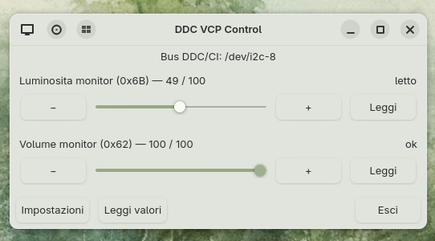
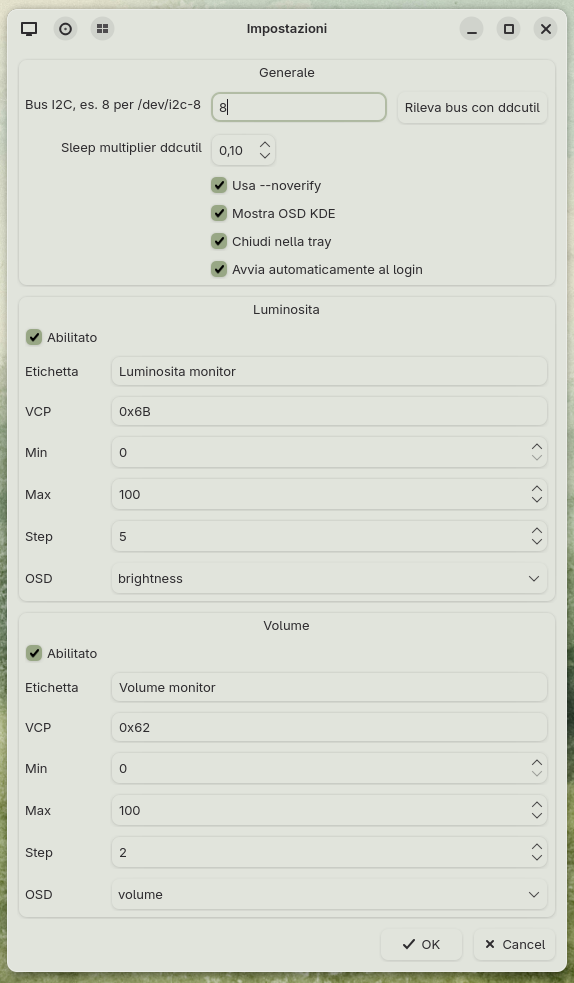

# DDC VCP Control

**DDC VCP Control** is a small Qt/PySide6 desktop utility for Linux that lets you control custom DDC/CI VCP codes from a simple graphical interface.

It was created for monitors that do not expose brightness or speaker volume through the usual desktop controls, or that use non-standard VCP codes.

The app provides configurable sliders for:

- monitor brightness;
- monitor speaker volume;
- custom VCP codes;
- KDE OSD feedback;
- XDG/KDE autostart.

> This project was written entirely with the assistance of AI.  
> The code was generated with ChatGPT and then tested and configured on real hardware by the maintainer.

---

## Why this exists

Some monitors expose useful controls through DDC/CI, but desktop environments may not support the exact VCP codes used by a specific model.

For example, on some monitors:

| Function | Standard / common VCP | Custom example |
|---|---:|---:|
| Brightness | `0x10` | `0x6B` |
| Speaker volume | `0x62` | `0x62` |

KDE/Plasma usually controls audio through PipeWire/PulseAudio and brightness through PowerDevil/backlight/DDC backends. This is not always enough for monitors that expose hardware speaker volume or non-standard brightness controls.

DDC VCP Control lets the user choose the VCP codes manually.

---

## Features

- Simple Qt GUI.
- Two configurable sliders by default:
  - brightness;
  - monitor volume.
- Custom VCP code per slider.
- Configurable I2C bus, for example `/dev/i2c-8`.
- Configurable step size, min and max values.
- Optional KDE OSD integration.
- Optional autostart at login.
- Tray icon support.
- Fast shortcut mode for keyboard keys, knobs or macro pads.
- Uses `ddcutil` under the hood.
- Does not require patching KDE, PowerDevil or the kernel.

---

## Screenshot

### Main window



### Settings window



## Requirements

Runtime dependencies:

- Python 3;
- PySide6;
- ddcutil;
- working DDC/CI access to the monitor.

Optional:

- `qdbus6` or `qdbus` for KDE OSD feedback.

### Arch / CachyOS / Manjaro

```bash
sudo pacman -S python-pyside6 ddcutil qt6-tools
```

### Debian / Ubuntu

Package names may vary depending on distribution version:

```bash
sudo apt install python3-pyside6.qtwidgets ddcutil qt6-tools-dev-tools
```

If PySide6 is not available through your distribution packages, use a virtual environment or your preferred Python package manager.

---

## DDC/CI permissions

Do **not** run this application with `sudo`.

Your user must be allowed to access the relevant `/dev/i2c-*` device, or you must use a suitable DDC/CI service setup.

Check whether your monitor is visible:

```bash
ddcutil detect
```

Example output:

```text
I2C bus: /dev/i2c-8
Monitor: ...
```

In this example, the bus number is:

```text
8
```

You can test a VCP manually:

```bash
ddcutil --bus 8 getvcp 0x62
ddcutil --bus 8 setvcp 0x62 50
```

---

## Installation

Clone the repository:

```bash
git clone https://github.com/alegaab/ddc-vcp-control.git
cd ddc-vcp-control
```

Install the script locally:

```bash
mkdir -p ~/.local/bin
cp ddc-vcp-control ~/.local/bin/ddc-vcp-control
chmod +x ~/.local/bin/ddc-vcp-control
```

Make sure `~/.local/bin` is in your `PATH`.

Run:

```bash
ddc-vcp-control
```

Or directly:

```bash
~/.local/bin/ddc-vcp-control
```

---

## Desktop entry

To add the app to your desktop menu:

```bash
mkdir -p ~/.local/share/applications
cp desktop/ddc-vcp-control.desktop ~/.local/share/applications/
update-desktop-database ~/.local/share/applications 2>/dev/null || true
```

On KDE you can also run:

```bash
kbuildsycoca6
```

If the desktop entry cannot find the executable, edit:

```text
~/.local/share/applications/ddc-vcp-control.desktop
```

and replace:

```ini
Exec=ddc-vcp-control
```

with the full path, for example:

```ini
Exec=/home/YOUR_USER/.local/bin/ddc-vcp-control
```

---

## Configuration

Configuration is stored in:

```text
~/.config/ddc-vcp-control/config.json
```

Default configuration:

| Control | Default VCP | Purpose |
|---|---:|---|
| Brightness | `0x6B` | Custom brightness / backlight control |
| Volume | `0x62` | Monitor speaker volume |

The bus defaults to:

```text
8
```

which corresponds to:

```text
/dev/i2c-8
```

You can change all of these values from the app settings window.

---

## Keyboard shortcuts

The app supports command-line actions that can be assigned to KDE shortcuts, keyboard media keys, macro pads or knobs.

### Brightness up

```bash
ddc-vcp-control brightness-up
```

### Brightness down

```bash
ddc-vcp-control brightness-down
```

### Set brightness to a fixed value

```bash
ddc-vcp-control brightness-set 50
```

### Monitor volume up

```bash
ddc-vcp-control volume-up
```

### Monitor volume down

```bash
ddc-vcp-control volume-down
```

### Set monitor volume to a fixed value

```bash
ddc-vcp-control volume-set 40
```

On KDE Plasma:

```text
System Settings → Keyboard → Shortcuts → Add Command
```

Then assign the desired key to the command.

Example full path:

```bash
/home/YOUR_USER/.local/bin/ddc-vcp-control brightness-up
```

---

## Autostart

Autostart can be enabled directly from the app settings.

When enabled, the app creates an XDG autostart entry in:

```text
~/.config/autostart/ddc-vcp-control.desktop
```

It starts hidden in the system tray using:

```bash
ddc-vcp-control --tray
```

---

## Performance notes

DDC/CI communication is relatively slow compared with normal software volume or brightness controls.

For better responsiveness, the app uses:

- cached values for shortcut actions;
- KDE OSD feedback before the monitor finishes applying the value;
- background DDC writes;
- `--noverify` by default;
- configurable `--sleep-multiplier`.

Recommended values:

```text
noverify: enabled
sleep multiplier: 0.1 - 0.3
```

If your monitor sometimes ignores commands, increase the sleep multiplier.

---

## Safety warning

DDC/CI VCP codes can change monitor settings at a low level.

Only enable VCP codes that you understand or have already tested with tools such as:

```bash
ddcutil
ddcui
```

Useful commands:

```bash
ddcutil detect
ddcutil --bus 8 capabilities
ddcutil --bus 8 getvcp 0x62
ddcutil --bus 8 setvcp 0x62 50
```

Do not randomly write values to unknown VCP codes.

---

## Tested hardware

Tested with:

| Monitor | Bus | Brightness VCP | Volume VCP |
|---|---:|---:|---:|
| Fujitsu B24W-7 LED | `/dev/i2c-8` | `0x6B` | `0x62` |

Other monitors may require different VCP codes.

---

## Development

Run from the project directory:

```bash
python ./ddc-vcp-control
```

Or, if executable:

```bash
./ddc-vcp-control
```

Useful debug commands:

```bash
ddcutil detect
ddcutil --bus 8 getvcp 0x6B
ddcutil --bus 8 getvcp 0x62
```

---

## AI disclosure

This project was written entirely with the assistance of AI.

The initial code, documentation and project structure were generated with ChatGPT.  
The maintainer tested the application on real hardware and adjusted the configuration for actual DDC/CI behavior.

Contributions, bug reports and hardware compatibility reports are welcome.

---

## License

MIT License.
